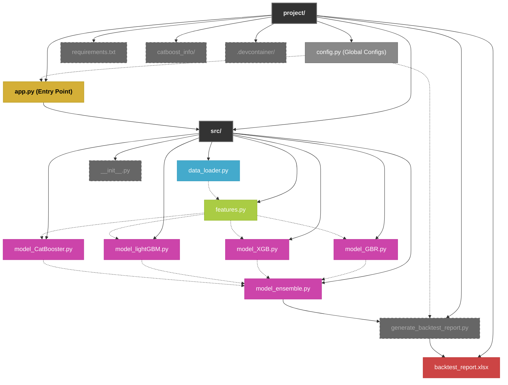

```mermaid
graph TD
    classDef file fill:#222,stroke:#555,stroke-width:1px,color:#ddd;
    classDef folder fill:#333,stroke:#666,stroke-width:2px,color:#eee,font-weight:bold;
    classDef main fill:#d4af37,stroke:#c4a732,stroke-width:2px,color:#000,font-weight:bold;
    classDef config fill:#888,stroke:#666,stroke-width:1px,color:#fff;
    classDef data fill:#44aacc,stroke:#3399bb,stroke-width:1px,color:#fff;
    classDef feature fill:#aacc44,stroke:#99bb33,stroke-width:1px,color:#fff;
    classDef model fill:#cc44aa,stroke:#bb3399,stroke-width:1px,color:#fff;
    classDef output fill:#cc4444,stroke:#bb3333,stroke-width:1px,color:#fff;
    classDef special fill:#666,stroke:#555,stroke-width:1px,color:#aaa,stroke-dasharray: 5 5;

    %% DEFINE NODES (WITH QUOTES)
    P["project/"]

    App["app.py (Entry Point)"]
    Config["config.py (Global Configs)"]
    RepGen["generate_backtest_report.py"]
    Req["requirements.txt"]
    BTR["backtest_report.xlsx"]

    Src["src/"]
    DL["data_loader.py"]
    Feat["features.py"]
    M_GBR["model_GBR.py"]
    M_XGB["model_XGB.py"]
    M_LGBM["model_lightGBM.py"]
    M_CB["model_CatBooster.py"]
    M_Ens["model_ensemble.py"]
    Init["__init__.py"]

    CB_Info["catboost_info/"]
    Dev[".devcontainer/"]

    %% STYLING
    class P,Src folder;
    class App main;
    class Config config;
    class DL data;
    class Feat feature;
    class M_GBR,M_XGB,M_LGBM,M_CB,M_Ens model;
    class BTR output;
    class RepGen,Req,Init,CB_Info,Dev special;

    %% CONNECTIONS
    P --> App
    P --> Config
    P --> RepGen
    P --> Req
    P --> BTR
    P --> Src
    P --> CB_Info
    P --> Dev

    Src --> DL
    Src --> Feat
    Src --> M_GBR
    Src --> M_XGB
    Src --> M_LGBM
    Src --> M_CB
    Src --> M_Ens
    Src --> Init

    %% DATA FLOW
    DL -.-> Feat
    Feat -.-> M_GBR
    Feat -.-> M_XGB
    Feat -.-> M_LGBM
    Feat -.-> M_CB

    M_GBR -.-> M_Ens
    M_XGB -.-> M_Ens
    M_LGBM -.-> M_Ens
    M_CB -.-> M_Ens

    App --> Src
    Config -.-> App
    Config -.-> RepGen
    M_Ens --> RepGen
    RepGen --> BTR
```